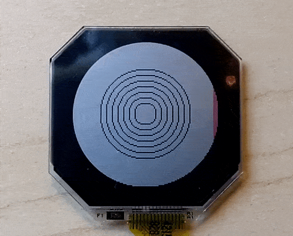

# ls010b7dh01

## Functionality
- Draw to the screen pixel by pixel
- Draw rectangles to the screen
- Draw circles to the screen
- Enable/disable the display

## TODO
- Better documentation
- Draw text 
- Draw lines
- Change thickness of lines being drawn
- Use some other drawing library

## Examples

Examples of the usage can be found in the [Prusto Watch firmware repo](https://github.com/byronwasti/prusto-watch)

## License

Licensed under either of

- Apache License, Version 2.0 (LICENSE-APACHE or http://www.apache.org/licenses/LICENSE-2.0)
- MIT license (LICENSE-MIT or http://opensource.org/licenses/MIT)

at your option.

## Contribution

Unless you explicitly state otherwise, any contribution intentionally submitted for inclusion in the work by you, as defined in the Apache-2.0 license, shall be dual licensed as above, without any additional terms or conditions.

